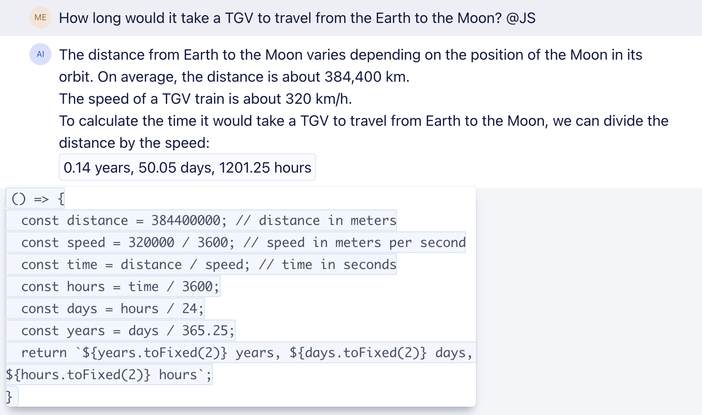
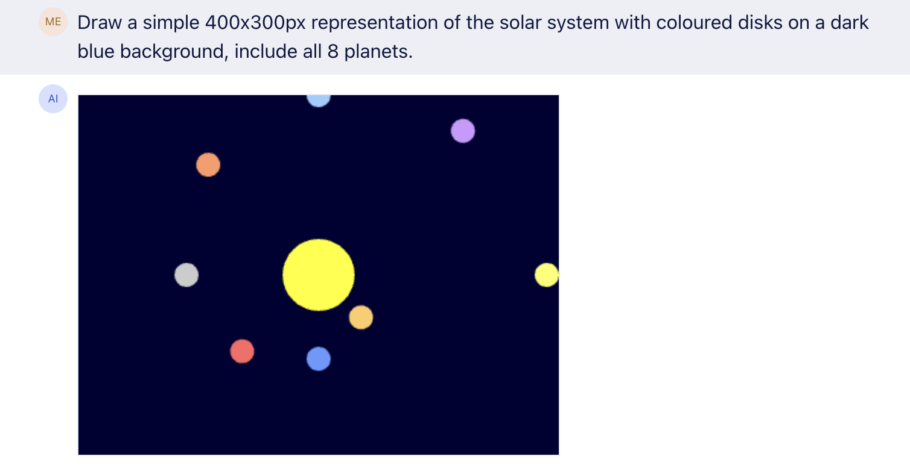
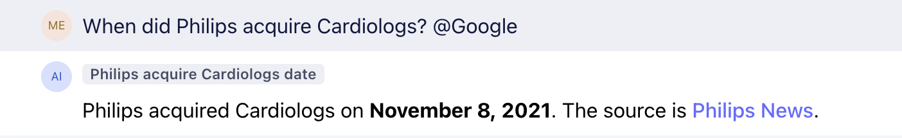
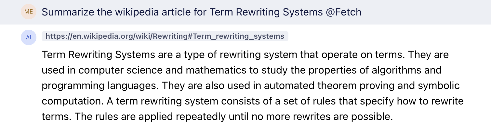
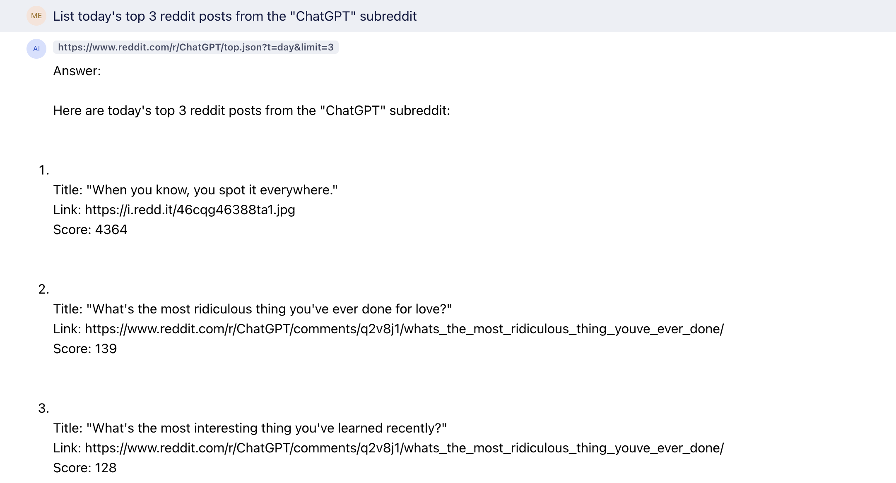

# PluGPT

Extendable chat interface for OpenAI's GPT chat models with support for custom plugins.

## Default Plugins

### @JS: Running JavaScript Code

### @Google: Google Search

### @Fetch: Fetching URL Contents

## Creating a new plugin

For examples on how to create a new plugin, look a the `src/plugins` folder.